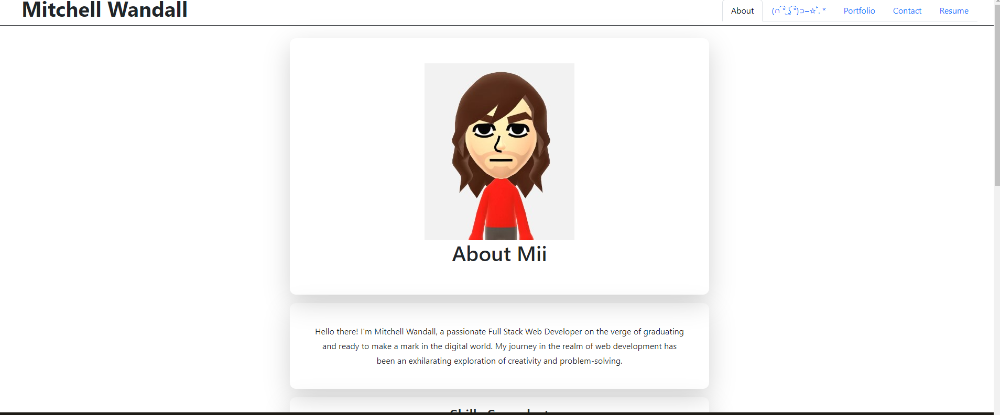

# React Portfolio

## Description

- I wanted to create an updated portfolio using the new tools I have picked up.
- I wanted to explore with tailwind css and react.
- Having a single page application with multiple components expands the capabilities of a web app.
- I learned how to separate components and swap between them using react.

## Table of Contents 

- [Installation](#installation)
- [Usage](#usage)
- [Credits](#credits)
- [License](#license)

## Installation

If you would like to install my resume, navigate to the Resume tab and click the link in the top left.

## Usage
[Live Site](https://scintillating-salmiakki-815a31.netlify.app/)

## Credits

[readMe guide](https://coding-boot-camp.github.io/full-stack/github/professional-readme-guide)

## License

MIT License

Copyright (c) 2023 Mitchell Wandall

Permission is hereby granted, free of charge, to any person obtaining a copy
of this software and associated documentation files (the "Software"), to deal
in the Software without restriction, including without limitation the rights
to use, copy, modify, merge, publish, distribute, sublicense, and/or sell
copies of the Software, and to permit persons to whom the Software is
furnished to do so, subject to the following conditions:

The above copyright notice and this permission notice shall be included in all
copies or substantial portions of the Software.

THE SOFTWARE IS PROVIDED "AS IS", WITHOUT WARRANTY OF ANY KIND, EXPRESS OR
IMPLIED, INCLUDING BUT NOT LIMITED TO THE WARRANTIES OF MERCHANTABILITY,
FITNESS FOR A PARTICULAR PURPOSE AND NONINFRINGEMENT. IN NO EVENT SHALL THE
AUTHORS OR COPYRIGHT HOLDERS BE LIABLE FOR ANY CLAIM, DAMAGES OR OTHER
LIABILITY, WHETHER IN AN ACTION OF CONTRACT, TORT OR OTHERWISE, ARISING FROM,
OUT OF OR IN CONNECTION WITH THE SOFTWARE OR THE USE OR OTHER DEALINGS IN THE
SOFTWARE.

## How to Contribute

Feel free to use this code. If you have any suggestions or would like to see more of my work, please check out my [Github](https://github.com/MWandall).